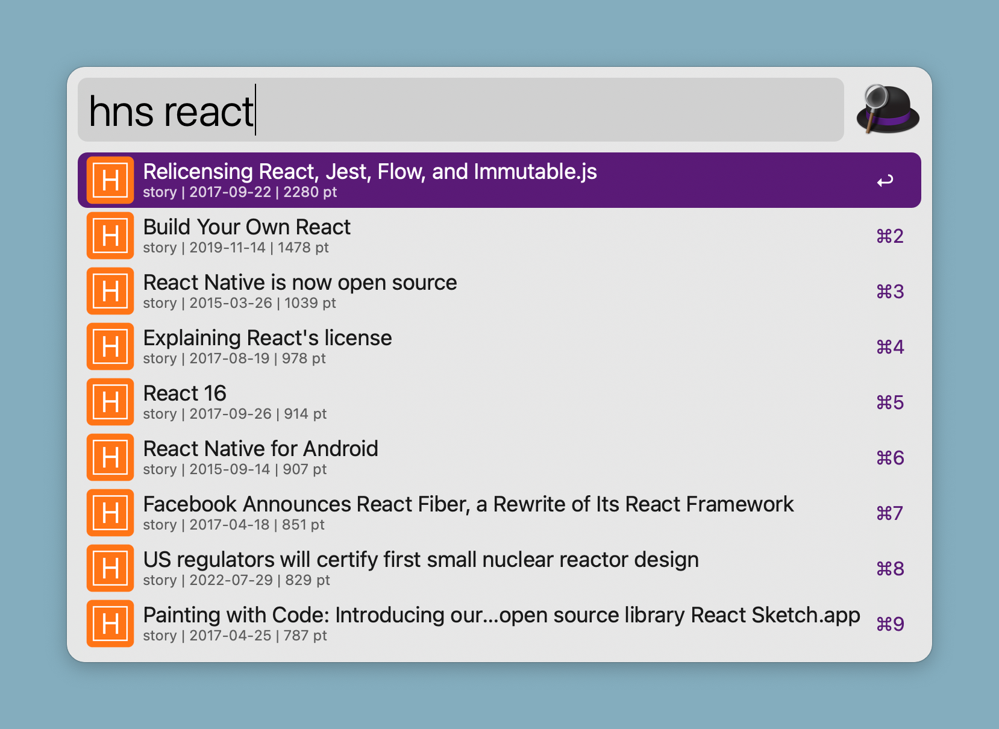

Hacker News Search (Alfred Workflow)
---

**Hacker News Search** is an [Alfred workflow](https://www.alfredapp.com/workflows/) that let you quickly search for specific keywords or topics and find relevant articles, posts, and comments on the popular tech community site [Hacker News](https://news.ycombinator.com/). 

To use the workflow, you simply need to activate Alfred and type in the keyword "hns" followed by the search query you want to perform. For example, if you wanted to search for articles related to artificial intelligence, you would type "hns ai" into Alfred's search bar. The workflow will then query the Algolia search API (https://hn.algolia.com/) to find relevant articles, posts, and comments on Hacker News, and display the results directly in Alfred's search bar.

The workflow requires "jq" to be installed on the system. "jq" is a lightweight and flexible command-line JSON processor that is used by the workflow to parse and manipulate the response from the search API.

To install "jq," the easiest way would probably be using homebrew: `brew install jq`.

## Install

You can install the workflow from [the Gallery page](https://alfred.app/workflows/jereze/hacker-news-search/) or download it from [Github releases](https://github.com/jereze/alfred-hacker-news-search/releases/latest).